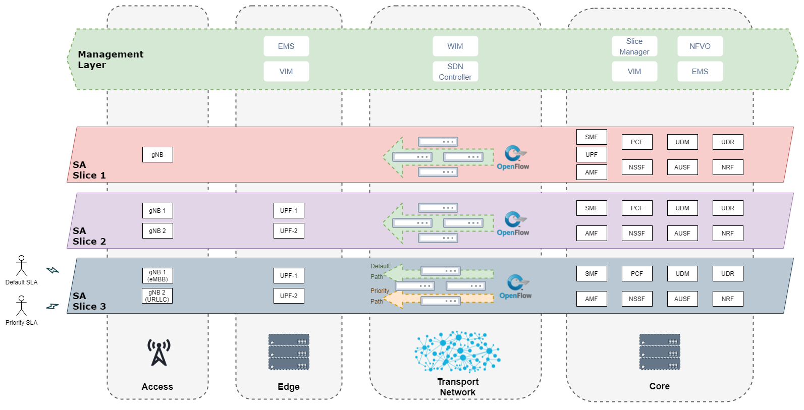

# Katana Slice Manager


----------

[](https://github.com/medianetlab/katana-slice_manager/stargazers)
[](https://github.com/medianetlab/katana-slice_manager/network/members)
[](https://github.com/medianetlab/katana-slice_manager/graphs/commit-activity)

[](https://github.com/medianetlab/katana-slice_manager/watchers)
[](https://github.com/medianetlab/katana-slice_manager/graphs/contributors)
[](https://github.com/medianetlab/katana-slice_manager/issues)

[](https://jenkins.medianetlab.gr/job/katana/job/mnl.testing/)

----------

## :page_with_curl: Introduction to Network Slicing

Network slicing is a 5G cutting edge technology that enables the creation of multiple virtual networks on top of shared physical infrastructure, allowing operators to provide portions of their networks that fit the requirements defined by various vertical industries. A network slice can be described as the collection of multiple sub-slices of different domains, such as the Core Datacenter, the Transport network, and one or numerous Edge Locations. The figure below depicts some examples of 5G Network Slices:



Katana Slice Manager is a centralized software component that provides an interface for creating, modifying, monitoring, and deleting slices. Through the North Bound Interface (NBI), the Slice Manager receives the Network Slice Template (NEST) for creating network slices and provides the API for managing and monitoring them. Through the South Bound Interface (SBI), it communicates with the Network Sub-Slice Manager components of the Management Layer, namely the Virtual Infrastructure Manager (VIM), the NFV Orchestrator (NFVO), the Element Management System (EMS), and the WAN Infrastructure Management (WIM).

Katana Slice Manager is based on a highly modular architecture, built as a mesh of microservices, each of which is running on a docker container. The key advantages of this architectural approach are that it offers simplicity in building and maintaining applications, flexibility and scalability, while the containerized approach makes the applications independent of the underlying system.

## :clipboard: Features

- Start, Stop, Inspect End-to-End Network Slices
- OpenAPIs supported by Swagger-io tool
- Modular architecture for supporting different infrastructure technologies
- Integrated CLI tool
- Prometheus and Grafana Monitoring modules
- Slice Deployment and Configuration measurements
- CI/CD procedures

## :hammer_and_pick: Quick Start

### Requirements

- docker version >= 18.09.6
- docker-compose version >= 1.17.1

### Build

Build the Katana Docker images and install the katana CLI command on the local system.

``` bash
bash bin/build.sh [-r | --release <RELEASE_NUMBER>] [--docker_reg <REMOTE_DOCKER_REGISTRY>] [--docker_repo <DOCKER_REPOSITORY>] [--docker_reg_user <REGISTRY_USER>] [--docker_reg_passwd <REGISTRY_PASSWORD>] [--push] [--dev] [-h | --help]
```

Options:

- __[-r | --release <RELEASE_NUMBER>] :__ Define the release that will match the Docker Tag of Katana Docker images (Default: :test).
- __[--docker_reg <REMOTE_DOCKER_REGISTRY>] :__ Define the remote Docker registry. If no docker registry is specified, Katana will try to use the public Docker hub
- __[--docker_repo <DOCKER_REPOSITORY>] :__ Define the Docker repository
- __[--docker_reg_user <REGISTRY_USER>] :__ Define the user of the remote Docker registry
- __[--docker_reg_passwd <REGISTRY_PASSWORD>] :__ Define the password for the user of the remote Docker registry
- __[--push] :__ Push the images to the remote Docker registry
- __[--dev] :__ Create a dev workspace for development purposes
- __[-h | --help] :__ Print this message and quit

> Sudo privileges will be needed for installing the CLI command tool

### Deploy

Deploy katana Slice Manager service. The script will attempt to pull the defined Docker tag from the defined Docker registry/repository. Otherwise, it will build the images using the ":test" tag.

``` bash
bash bin/deploy.sh [-p | --publish] [-r | --release <RELEASE_NUMBER>] [--docker_reg <REMOTE_DOCKER_REGISTRY>] [--docker_repo <DOCKER_REPOSITORY>] [--docker_reg_user <REGISTRY_USER>] [--docker_reg_passwd <REGISTRY_PASSWORD>] [-m | --monitoring] [-h | --help]
```

Options:

- __[-p | --publish] :__ Expose Kafka end Swagger-ui using katana public IP
- __[-r | --release <RELEASE_NUMBER>] :__ Define the release that will match the Docker Tag of Katana Docker images (Default: :test).
- __[--docker_reg <REMOTE_DOCKER_REGISTRY>] :__ Define the remote Docker registry. If no docker registry is specified, Katana will try to use the public Docker hub
- __[--docker_repo <DOCKER_REPOSITORY>] :__ Define the Docker repository
- __[--docker_reg_user <REGISTRY_USER>] :__ Define the user of the remote Docker registry
- __[--docker_reg_passwd <REGISTRY_PASSWORD>] :__ Define the password for the user of the remote Docker registry
- __[-m | --monitoring] :__ Start Katana Slice Manager Slice Monitoring module
- __[--no_build] :__ Try to download Docker images, but do not build them
- __[-h | --help] :__ Print help message and quit

### Logs

Get the logs of katana-mngr and katana-nbi modules:

```bash
katana logs [-l | --limit N]
```

- __-l | --limit__: Show a limited number of lines from the end of the logs (default "all")

### Stop

Stop Katana Slice Manager:

```bash
bash bin/stop.sh [-c | --clear] [-h | --help]
```

- __[-c | --clear] :__ Remove the container volumes
- __[-h | --help] :__ Print help message and quit

### Uninstall

Remove katana Docker resources and the CLI command tool

```bash
bash bin/uninstall.sh
```

> Sudo privileges will be needed for removing the CLI command tool

### Monitoring

To start Prometheus and Grafana Monitoring modules add the `-m | --monitoring` flag to `deploy.sh` binary. Prometheus is running at port __9090__ and Grafana at port __3000__. A new dashboard will be created on Grafana for every new slice that is created.

By default Grafana credentials are admin:admin. To change it, create the `katana-grafana/.env` file with the following environmental variables:

```bash
GF_SECURITY_ADMIN_USER=USER
GF_SECURITY_ADMIN_PASSWORD=PASSWORD
```

## :keyboard: Development Environment

To create a development environment for katana on a Linux host, run:

```bash
bash bin/build.sh --dev
```

This will create hard links of the __shared_utils__ directory of both katana-mngr and katana-nbi on the root directory `./dev_shared_utils`. So any changes done on the existing files ./shared_utils directory will be reflected to __katana-mngr/katana/shared_utils__ and __katana-nbi/katana/shared_utils__ directories. To add new files that are created in the dev_shared_utils directory, run the command:

```bash
for dest in katana-{mngr,nbi}/katana/shared_utils/; do cp -al dev_shared_utils/{PATH_TO_NEW_FILE} $dest; done
```

It will also create a **dev** folder, where the example_config_files will be copied for providing direct access to testing configuration files.

You can also check the [Wiki "For Developers"](https://github.com/medianetlab/katana-slice_manager/wiki/developers) page for more details.

## :heavy_check_mark: CI/CD

The current implementation supports two pipelines, using the respective Jenkinsfile:

### Development/Integration Pipeline

- CI Pipeline using the file [jenkins/ci/Jenkinsfile](jenkins/ci/Jenkinsfile):
  - Builds the Katana Docker images and deploys a testing instance of Katana SM
  - Runs the defined Functional and Integration tests. Tests are defined in the folder [jenkins/ci/tests](jenkins/ci/tests)
  - If the changes are occurring on the master branch, the built images will be packaged and uploaded to the defined Docker registry
  - Required parameters/variables on Jenkins:
    - katana_reg: The remote Docker registry that will be used for pushing Docker Images
    - katana_repo: The remote Docker repository that will be used for pushing Docker Images
    - test_server: The label of the Jenkins agent that will be used for running the testing Katana instance
  - Required credentials on Jenkins:
    - katana-reg-creds: Username/Password for the remote Docker registry

> This Pipeline is executed on a testing environment

### Deployment Pipeline

- CD Pipeline using the file [jenkins/cd/Jenkinsfile](jenkins/cd/Jenkinsfile):
  - Builds the docker images using the latest tag
  - Deploys the latest version of Katana SM on the defined Operational environment
  - Sends notification on Slack
    - Required parameters/variables on Jenkins:
    - katana_reg: The remote Docker registry that will be used for pushing Docker Images
    - katana_repo: The remote Docker repository that will be used for pushing Docker Images
    - prod_server: The label of the Jenkins agent that will be used for running the stable Katana instance
    - prod_server_ip: The IP Address of the production server that will be used for hosting the stable Katana instance
  - Required credentials on Jenkins:
    - katana-reg-creds: Username/Password for the remote Docker registry

> This Pipeline is executed on a stable production/staging environment

## :book: Documentation

- [Wiki](https://github.com/medianetlab/katana-slice_manager/wiki)
- [5GENESIS Deliverable](https://5genesis.eu/wp-content/uploads/2019/10/5GENESIS_D3.3_v1.0.pdf)
